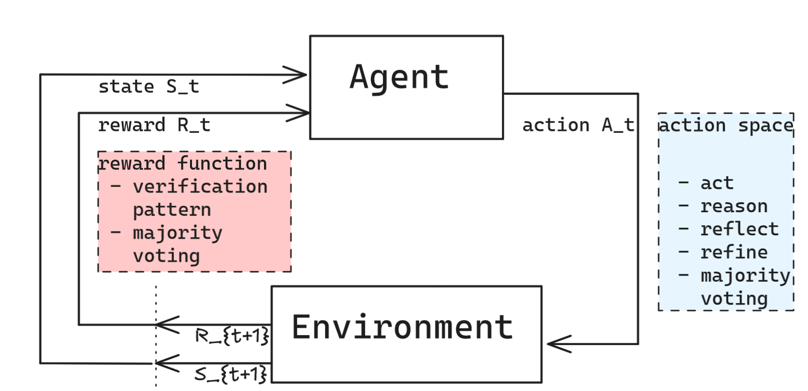

# A Taxonomy of RL Environments for LLM Agents

| | |
|---|---|
| **来源** | [leehanchung.github.io](https://leehanchung.github.io/blogs/2026/03/21/rl-environments-for-llm-agents/) |
| **归档日期** | 2026-04-07 |
| **分类** | [AI & 机器学习](../../archive/ai-ml/README.md) |
| **标签** | `强化学习` `LLM Agent` `RL环境` `训练框架` `奖励设计` |

## 核心内容摘要

本文对用于训练 LLM Agent 的强化学习环境进行了系统性分类与定义。作者将 RL 环境形式化为一个五元组 **E = {T, H, V, S, C}**：T（任务数据集）、H（Harness，模型交互脚手架）、V（Verifier，奖励/验证函数）、S（环境状态）、C（配置）。

文章区分了两种关键场景：**基础 Agent Loop**（单轮交互中 Agent 与环境的观察-行动循环）和**训练部署架构**（Trainer、模型推理服务、环境作为独立进程通过 API 通信的完整 RL 训练回路）。这两张图清晰地展示了从简单的 agent-environment 交互到完整 RL 训练基础设施的架构演进。

在奖励设计上，作者强调应优先使用程序化验证（字符串匹配、代码执行）而非 LLM-as-Judge，后者会引入评分者偏差（Scorer Independence 原则）。奖励粒度可分为轨迹级（最终结果）、轮次级（每次工具调用）和逐步过程奖励（Process Reward）。文章还指出训练环境与基准测试的本质区别：基准是静态的，而训练环境应随模型能力持续进化。

## 关键要点

- **环境五元组**：RL 环境 = {任务集 T, Harness H, Verifier V, 状态 S, 配置 C}，每个组件职责清晰、可独立设计
- **两层 Agent Loop**：Agent 与环境的基础交互回路 vs. 含 Trainer + 推理服务器 + 环境的完整训练架构（详见原文两图）
- **Scorer Independence**：用同一模型家族既生成补全又做评判，会导致 Agent 学会"听起来对"而非"真正正确"，应优先选用程序化验证
- **奖励粒度三级**：轨迹级（最终输出是否通过）→ 轮次级（每次工具调用是否有效）→ 过程奖励（逐步打分），粒度越细训练信号越丰富但设计成本越高
- **环境多样性与质量同等重要**：单一场景的高质量环境不足以泛化，需覆盖多样任务分布
- **训练环境需持续演化**：基准冻结，训练环境应随 Agent 能力边界动态扩展，避免过拟合到固定任务集

## 重要图示

**图1 - 基础 Agent Loop**

展示 Agent 在单次轨迹中与环境的观察（Observation）-> 行动（Action）-> 奖励（Reward）循环结构。

**图2 - RL 训练部署架构**

展示 Trainer、模型推理服务器（Model Inference Server）、环境（Environment）作为三个独立进程，通过 API 相互通信的完整训练回路。

原文链接：[https://leehanchung.github.io/blogs/2026/03/21/rl-environments-for-llm-agents/](https://leehanchung.github.io/blogs/2026/03/21/rl-environments-for-llm-agents/)

## 我的思考与感悟

很认可这篇文章关于如何让 Agent 通过强化学习增强的思路。尤其是关于 Agent Loop 的两张图——从简单的单步交互到完整的分布式训练架构，把概念和工程实现都讲得非常清晰。五元组的形式化定义也很有价值，可以作为设计自己的 RL 训练环境时的检查框架。

---

*[← 返回分类](README.md) · [← 返回首页](../../README.md)*
