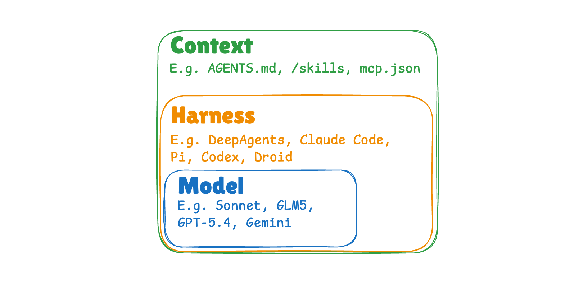
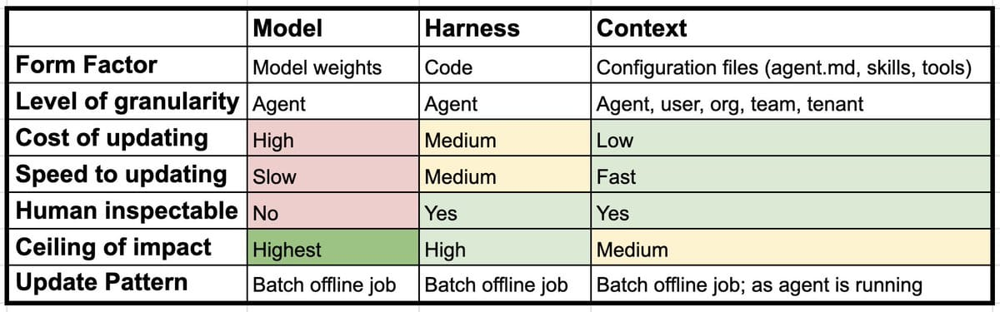

# AI Agent 的持续学习：模型、运行框架与上下文三层

| | |
|---|---|
| **来源** | [blog.langchain.com](https://blog.langchain.com/continual-learning-for-ai-agents) |
| **归档日期** | 2026-04-07 |
| **分类** | [AI & 机器学习](../../archive/ai-ml/README.md) |
| **标签** | `AI Agent` `持续学习` `运行框架` `上下文记忆` `LangSmith` |

## 核心内容摘要

这篇文章把 AI Agent 的持续学习拆成三个清晰层次：模型、运行框架与上下文。作者指出，业界一提 continual learning 往往只想到更新模型权重，但对 agent 系统来说，真正可优化的对象远不止模型本身。模型层关注 SFT、RL 等训练方式，却面临灾难性遗忘等经典难题；运行框架层关注驱动 agent 的代码、内置指令与工具，可通过 traces 回放、评测和 coding agent 自动改写来持续改进；上下文层则对应位于框架外部的指令、技能与记忆，可按 agent、用户或组织多层级沉淀与更新。文章最后强调，traces 是三层学习机制共同的基础设施，决定了系统能否形成可持续演化的反馈闭环。

## 关键要点

- **持续学习不只发生在模型层**：对 AI Agent 而言，模型、运行框架、上下文三层都可以独立演化，且各自对应不同的优化方法与成本结构
- **模型层是最传统但也最重的一层**：可通过 SFT、RL 等方式更新权重，但会遇到灾难性遗忘，通常只能在 agent 级而不是用户级实施
- **运行框架层更接近工程优化**：通过收集任务 traces、评测结果和执行日志，可以让 coding agent 直接修改 agent harness 代码与常驻工具配置
- **上下文层就是可学习的记忆与配置**：位于框架之外，包含说明、技能、工具声明等，既可在 agent 级更新，也可按用户、团队、组织分层维护
- **上下文更新有冷热两种路径**：既可以离线从历史 traces 中提炼后再写回，也可以在 agent 执行任务的热路径中即时写入记忆
- **traces 是三层学习的统一燃料**：无论训练模型、优化运行框架还是沉淀上下文，都依赖完整执行轨迹作为反馈与改进依据

## 术语翻译

- **Model**：模型
- **Harness**：运行框架
- **Context**：上下文记忆

这里将 `harness` 译为“运行框架”，因为文章中的含义不是狭义框架库，而是“驱动 agent 运行的代码、常驻指令和工具集合”；将 `context` 译为“上下文记忆”，因为它既承担配置作用，也明确指向可持续更新的 memory 层。

## 重要图示

**图1 - Agent 持续学习三层分层图**

原图 URL：`https://storage.ghost.io/c/97/88/97889716-a759-46f4-b63f-4f5c46a13333/content/images/2026/04/Screenshot-2026-04-04-at-8.22.30---AM.png`

说明：展示 agentic system 的三层结构，把可学习对象明确拆成模型、运行框架、上下文记忆三部分，并给出 Claude Code 与 OpenClaw 的映射示例。

**图2 - 三层持续学习方式对比图**

原图 URL：`https://storage.ghost.io/c/97/88/97889716-a759-46f4-b63f-4f5c46a13333/content/images/2026/04/e0f61fc1-9e93-4008-9042-c0551f05aeee.jpeg`

说明：对比模型层、运行框架层、上下文记忆层在更新对象、粒度、典型方法与适用范围上的差异，帮助建立 agent 持续学习的分层认知。

## 我的思考与感悟

对于 agentic 的认知就应该是这 3 层，model、harness、context，万变不离其中。这三个需要找合适的中文表达。还要提取分层的图和对比的图。

---

*[← 返回分类](README.md) · [← 返回首页](../../README.md)*
