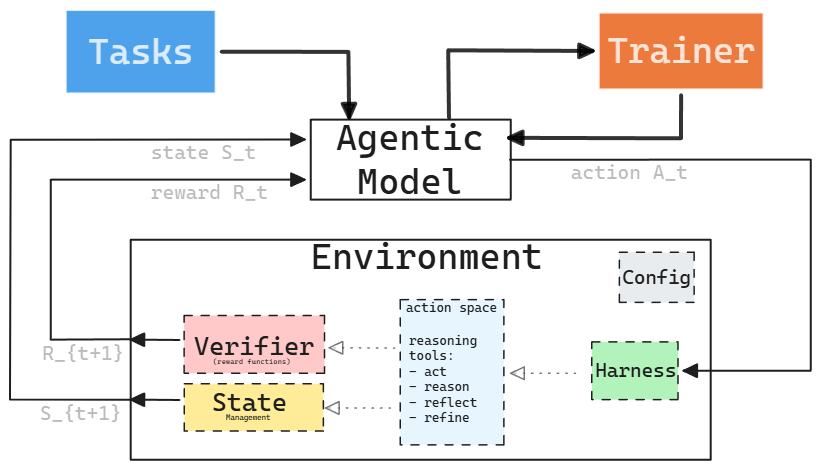

# A Taxonomy of RL Environments for LLM Agents

> 副标题：LLM Agent 强化学习环境分类

| | |
|---|---|
| **原始标题** | A Taxonomy of RL Environments for LLM Agents |
| **原始链接** | [leehanchung.github.io](https://leehanchung.github.io/blogs/2026/03/21/rl-environments-for-llm-agents/) |
| **原始发表日期** | 2026-03-21 |
| **归档日期** | 2026-04-07 |
| **分类** | [AI & 机器学习](../../archive/ai-ml/README.md) |
| **标签** | `强化学习` `LLM` `AI Agent` `训练框架` `奖励设计` |

## 核心内容摘要

这篇文章系统梳理了用于训练 LLM Agent 的强化学习环境，重点不在单个 benchmark，而在“什么样的环境结构才适合持续训练 agent”。作者将 RL 环境形式化为五个核心部件：任务集、交互 harness、验证器、环境状态与配置，并据此解释一个可训练环境应如何组织输入、行动、反馈与状态更新。文章尤其有价值的地方在于把“基础 agent loop”和“完整训练部署架构”明确区分开来，前者描述单条轨迹中的观察与行动循环，后者则覆盖 trainer、模型推理服务和环境之间的工程协作关系。对于实际构建 agent 训练系统的人，这篇文章相当于一份结构化设计清单。

## 关键要点

- **环境五元组**：RL 环境 = {任务集 T, Harness H, Verifier V, 状态 S, 配置 C}，每个组件职责清晰、可独立设计。
- **两层 Agent Loop**：Agent 与环境的基础交互回路 vs. 含 Trainer、推理服务、环境进程的完整训练架构。
- **Scorer Independence**：如果用同一模型家族既生成结果又做评判，训练会偏向“迎合评分器”，应优先使用程序化验证。
- **奖励粒度三级**：轨迹级、轮次级、过程级奖励各有适用范围，粒度越细，训练信号越强，设计成本也越高。
- **环境多样性很关键**：单一环境即便质量很高，也不足以支持 agent 泛化，任务分布覆盖面同样重要。
- **训练环境需要演化**：benchmark 可以冻结，训练环境则应随模型能力持续变化，避免学会刷固定题库。

## 重要图示

**图1 - 基础 Agent Loop**

展示 Agent 在单次轨迹中与环境的 Observation -> Action -> Reward 循环结构。

**图2 - RL 训练部署架构**

展示 Trainer、模型推理服务器与环境作为独立进程，通过 API 通信组成完整训练闭环。

原文链接：[https://leehanchung.github.io/blogs/2026/03/21/rl-environments-for-llm-agents/](https://leehanchung.github.io/blogs/2026/03/21/rl-environments-for-llm-agents/)

## 我的思考与感悟

很认可这篇文章关于如何让 Agent 通过强化学习增强的思路。尤其是关于 Agent Loop 的两张图，从简单的单步交互到完整的分布式训练架构，把概念和工程实现都讲得非常清楚。五元组的形式化定义也很有价值，可以直接作为设计 RL 训练环境时的检查框架。

---

*[← 返回分类](README.md) · [← 返回首页](../../README.md)*
