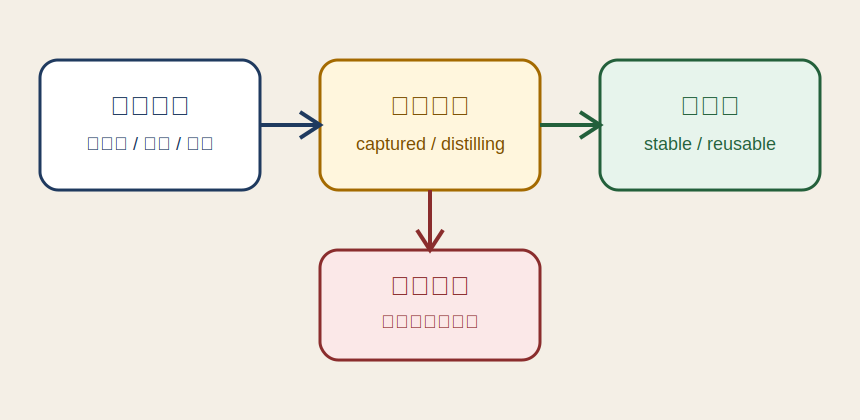

# 上下文卡片化捕获流程

> 副标题：把零散输入先压成卡片，再决定是否沉淀为知识点

| | |
|---|---|
| **记录时间** | 2026-04-08 11:40 GMT+8 |
| **灵感类型** | mixed |
| **来源场景** | 读完上下文工程相关文章后，联想到个人知识库也需要一个低摩擦入口 |
| **状态** | distilling |
| **关联知识点** | [上下文先卡片化，再知识化](../knowledge/20260408-context-card-knowledge-loop.md) |
| **标签** | `知识管理` `Context Engineering` `PKM` |

## 灵感内容

我不想每次有想法都直接写成完整文章。更合理的做法是先允许自己丢下一张“上下文卡片”：一句判断、一个截图、一个白板草图，或者几者混在一起。卡片的目标不是完整，而是低摩擦地保住当下最有价值的信号。

如果后续发现这张卡片反复出现、可以迁移到别的问题、或者能指导实际行动，再把它升级成知识点。这样知识库就不是一上来要求高质量，而是先允许“粗糙但可追溯”的输入，再通过沉淀流程提纯。

## 可沉淀方向

- 把“灵感卡片”定义成知识库的最小输入单位，降低记录门槛。
- 为每张卡片补一个状态流转：`captured -> distilling -> archived`。
- 知识点只保留可迁移的结论与方法，不复制原始灵感的偶然细节。

## 后续动作

- 观察一周内是否真的更容易持续记录。
- 如果效果稳定，再补批量整理和标签回顾流程。

---

*[← 返回灵感列表](README.md) · [← 返回首页](../README.md)*
