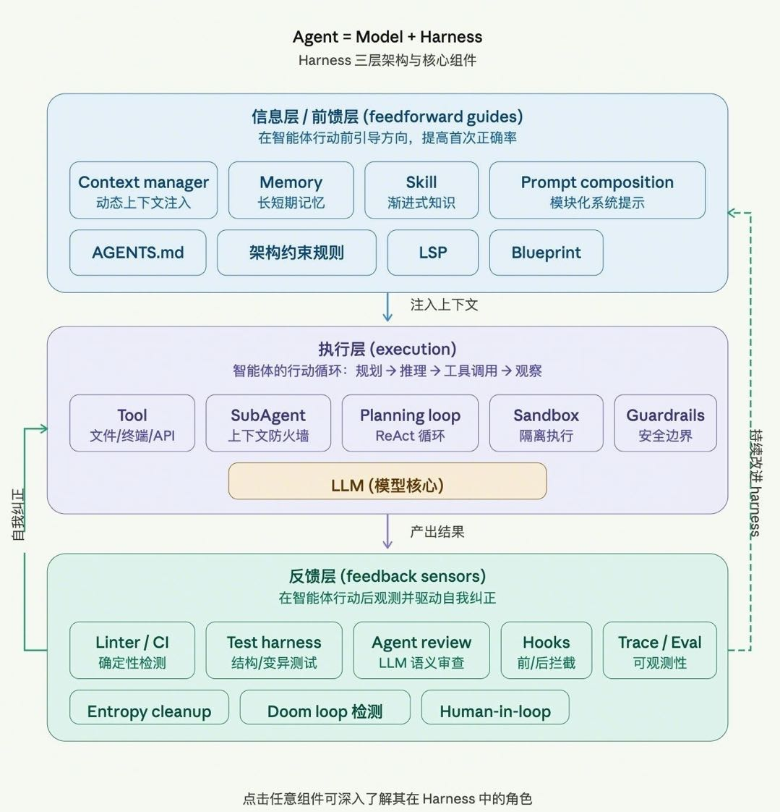

# harness 架构图

| | |
|---|---|
| **记录时间** | 2026-04-08 12:06 GMT+8 |
| **灵感类型** | image |
| **来源场景** | 看到一张关于 harness 的架构图，信息分层清楚，表达方式值得保留 |
| **状态** | captured |
| **关联知识点** | 待补充 |
| **标签** | `Architecture` `Harness` `Diagram` |

## 灵感内容

这张图把 harness 相关模块和关系画得比较清楚，适合作为后续拆解系统边界、职责分层和数据流时的参考样本。

## 可沉淀方向

- 总结这张架构图的分层方式，提炼成通用的系统示意图表达模板。
- 分析图中的模块边界和连接关系，看看是否适合迁移到自己的架构文档习惯。
- 如果后续补到更多 harness 资料，可以进一步沉淀为一张文字版架构说明卡片。

## 后续动作

- 后续如有上下文，再补充这张图对应的模块名称和职责说明。
- 观察是否值得继续整理成 knowledge 条目或配套文字解读。

---

*[← 返回灵感列表](README.md) · [← 返回首页](../README.md)*
